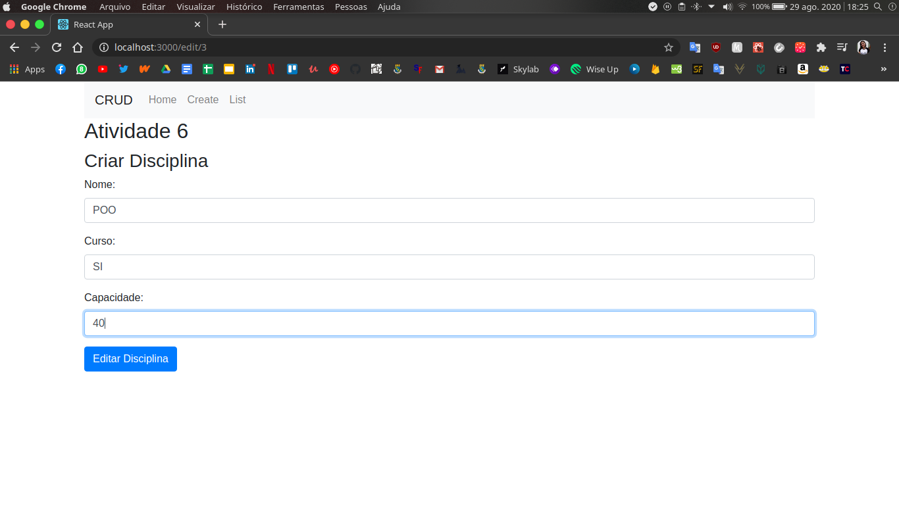
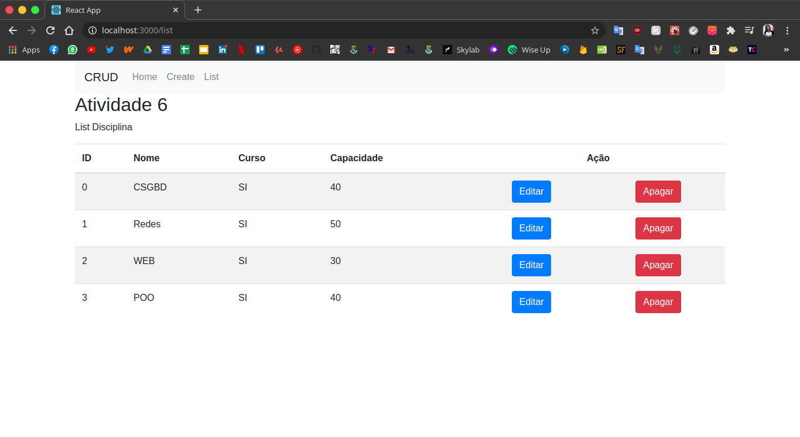

<h1 align="center">
  Atividade 6 - Servidor Express Puro + React
</h1>


<p align="center">
  
  
  
  
  
  
  <a href="https://github.com/LeticiaFarias/Web-2020.1/commits/master">
    
  </a>
  
  

  

</p>
<p align="center">
  <a href="https://insomnia.rest/run/?label=Atividade%206&uri=https%3A%2F%2Fraw.githubusercontent.com%2FLeticiaFarias%2Finsomnia%2Fmaster%2FInsomnia_2020-08-29.json%3Ftoken%3DAJRU632O2ETTE3GP6MILXJK7KQC6K" target="_blank"></a>
</p>

<h4> Create </h4>


<h4> List </h4>


<h4> Edit </h4>



<h4> List depois de Edit </h4>




## 🚀 Tecnologias

-  [Node.js](https://nodejs.org/en/)
-  [ReactJS](https://reactjs.org/)
-  [Express](https://expressjs.com/pt-br/)
-  [Nodemon](https://nodemon.io/)
-  [Bootstrap](https://getbootstrap.com/)
-  [Styled Components](https://styled-components.com/)
-  [Prettier](https://prettier.io/)
-  [EditorConfig](https://editorconfig.org/)

## 💻 Instalação, execução e desenvolvimento

Importe o `Insomnia.json` no Insomnia App ou click no botão [Run in Insomnia](#insomniaButton)

### Pré-requisitos

- [Node.js](https://nodejs.org/en/)
- [Yarn](https://classic.yarnpkg.com/) ou [npm](https://www.npmjs.com/)

```bash
# Faça o downloald do projeto no seu computador
$ git clone https://github.com/LeticiaFarias/Web-2020.1

# Entre na pasta raiz do projeto
$ cd Aulas-remotas/atividade_6

# Entre na pasta backend
$ cd backend

# Instale as dependências
$ yarn

# Tudo pronto para iniciar o servidor
$ yarn dev

# Entre na pasta frontend
$ cd frontend

# Instale as dependências
$ yarn

# Tudo pronto para iniciar a aplicação web
$ yarn start

```

<div align="center">

Feito com ❤️ by [Leticia Farias](https://www.linkedin.com/in/lettifarias/)

</div>